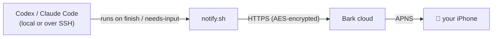

# agent-push

**Get a push notification on your iPhone the moment Codex or Claude Code finishes a turn
or needs your input** — with the actual last message, an app icon, and a louder alert when
an agent is *blocked waiting on you*. No server, no domain, free, and **end-to-end
encrypted** so nobody in the middle can read your messages.

It uses [**Bark**](https://github.com/Finb/Bark), which pushes over Apple's APNS directly
(reliable, unlike Firebase-based services), plus a tiny `notify.sh` that each agent runs.



---

## Two ways to set it up

### ⚡ Let your agent do it (easiest)
Open this repo in **Codex** or **Claude Code** and say:

> "Set up agent-push for me."

The agent reads [`AGENTS.md`](AGENTS.md) (Claude reads [`CLAUDE.md`](CLAUDE.md)) and walks you
through it — it just needs your Bark URL and encryption key.

### 🔧 Manual (5 minutes)

**1. Install the Bark app** → https://apps.apple.com/app/id1403753865
Open it and copy the device URL at the top: `https://api.day.app/XXXXXXXX`.

**2. Turn on encryption** (recommended) — in Bark: **Settings → Encryption**, choose
**AES256 / CBC**, and set a **32-character key**. Keep that key.

**3. Install the script**
```sh
git clone https://github.com/jonthnoz/agent-push ~/git/agent-push
cd ~/git/agent-push
mkdir -p ~/.config/agent-notify
cp config.env.example ~/.config/agent-notify/config.env
chmod 600 ~/.config/agent-notify/config.env
chmod +x notify.sh
```
Edit `~/.config/agent-notify/config.env`:
```sh
BARK_URL="https://api.day.app/XXXXXXXX"
BARK_KEY="your-32-character-encryption-key"   # leave empty to skip encryption
```

**4. Wire the agent(s) you use** (absolute path to `notify.sh`):

<details><summary><b>Codex</b> — <code>~/.codex/config.toml</code></summary>

```toml
notify = ["/Users/you/git/agent-push/notify.sh"]
```
</details>

<details><summary><b>Claude Code</b> — <code>~/.claude/settings.json</code> (merge into existing <code>hooks</code>)</summary>

```json
"hooks": {
  "Stop": [
    { "hooks": [ { "type": "command", "command": "/Users/you/git/agent-push/notify.sh" } ] }
  ],
  "Notification": [
    { "hooks": [ { "type": "command", "command": "/Users/you/git/agent-push/notify.sh" } ] }
  ]
}
```
</details>

**5. Test**
```sh
./notify.sh '{"type":"agent-turn-complete","last-assistant-message":"agent-push test ✅"}'
```
A banner should land on your phone.

---

## What you get

| Event | Notification | Alert |
|---|---|---|
| Codex turn complete | `Codex ✅ <project>` + last message | normal |
| Codex needs approval | `Codex ⏳ <project>` + the action | time-sensitive + rings |
| Claude Code finishes | `Claude ✅ <project>` + last message | normal |
| Claude Code needs input | `Claude ⏳ <project>` + the prompt | time-sensitive + rings |

- **Icons**: OpenAI mark for Codex, Claude mark for Claude (override via `ICON_*`).
- **Grouping**: notifications thread by project.
- **Blocked-on-you** events (approval / input) use `level=timeSensitive` (breaks through Focus)
  and `call=1` (rings ~30s) so you don't miss them.

> **Note — Codex approvals are terminal-only.** Codex fires its `notify` hook on turn
> completion but **not** when it asks for permission, so Codex approval prompts show in your
> terminal / desktop banner but don't reach your phone (Claude Code sends both). Tracked
> upstream: [openai/codex#11808](https://github.com/openai/codex/issues/11808).

## Requirements
`curl`, `jq`, `openssl`. macOS or Linux (Windows via WSL). Install `jq` with
`brew install jq` or `sudo apt-get install -y jq`.

## Scenarios
- **Only Codex, only Claude, or both** — wire just what you use.
- **Remote servers over SSH** — repeat steps 3–4 on each machine that runs an agent. It works
  over SSH with nothing extra because it's a plain outbound HTTPS call.
- **Privacy** — with `BARK_KEY` set, the payload is AES-encrypted on your machine and only
  decrypted inside the Bark app; Bark's server (and the network) see ciphertext only. Without a
  key, messages transit Bark's server in plaintext.

## Troubleshooting
- **Nothing arrives, even a raw `curl -d test "$BARK_URL"`** → the Bark app isn't getting APNS.
  Check Bark's notification permission, and disable any VPN, DNS blocker (Pi-hole/NextDNS), or
  iCloud Private Relay; reinstall Bark if needed.
- **Raw test works but encrypted doesn't** → the key/algorithm in the Bark app must match
  `BARK_KEY` exactly (32 chars ⇒ AES256 / CBC).
- **No project name / message on Codex** → `notify.sh` reads the project from the working
  directory and the message from Codex's event JSON; both populate in real runs.

## License
MIT — see [LICENSE](LICENSE).
