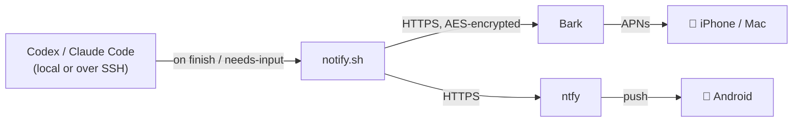

# agent-push

**Get a push notification on your phone the moment Codex or Claude Code finishes a turn
or needs your input** — with the actual last message, an app icon, and a louder alert when
an agent is *blocked waiting on you*. No server, no domain, free.

- **iPhone / Mac** → [**Bark**](https://github.com/Finb/Bark) (Apple APNs — reliable, with
  optional **end-to-end encryption**).
- **Android** → [**ntfy**](https://ntfy.sh) (no E2E; use a secret topic or self-host for privacy).

A tiny `notify.sh` sends to whichever backend(s) you configure — set one, or both.



---

## Two ways to set it up

### ⚡ Let your agent do it (easiest)
Open this repo in **Codex** or **Claude Code** and say:

> "Set up agent-push for me."

The agent reads [`AGENTS.md`](AGENTS.md) (Claude reads [`CLAUDE.md`](CLAUDE.md)) and walks you
through it — it just needs your Bark URL and encryption key.

### 🔧 Manual (5 minutes)

**1. Set up your phone's push app**
- **iPhone / Mac** — install **Bark** → https://apps.apple.com/app/id1403753865 , copy the
  device URL (`https://api.day.app/XXXX`). For privacy, enable encryption in Bark →
  **Settings → Encryption** (AES256 / CBC) with a **32-character key**.
- **Android** — install **ntfy** (Play Store / F-Droid), subscribe to an **unguessable**
  topic; your URL is `https://ntfy.sh/<that-topic>`. (No E2E — keep the topic secret or
  self-host ntfy for privacy.)

**2. Install the script**
```sh
git clone https://github.com/jonthnoz/agent-push ~/git/agent-push
cd ~/git/agent-push
mkdir -p ~/.config/agent-notify
cp config.env.example ~/.config/agent-notify/config.env
chmod 600 ~/.config/agent-notify/config.env
chmod +x notify.sh
```

**3. Fill in `~/.config/agent-notify/config.env`** — set the backend(s) you use:
```sh
BARK_URL="https://api.day.app/XXXX"           # iPhone/Mac (empty if none)
BARK_KEY="your-32-char-encryption-key"        # optional E2E; empty = plaintext
NTFY_URL="https://ntfy.sh/your-secret-topic"  # Android (empty if none)
```

**4. Wire the agent(s) you use** (absolute path to `notify.sh`):

<details><summary><b>Codex</b> — <code>~/.codex/config.toml</code></summary>

```toml
# "done" notifications (fires only on turn-complete):
notify = ["/Users/you/git/agent-push/notify.sh"]

# approval notifications (Codex >= 0.144) — fires only when Codex asks you to approve
# a tool (shell/apply_patch/MCP/network), not on every tool. matcher ".*" = all approvals.
[[hooks.PermissionRequest]]
matcher = ".*"
[[hooks.PermissionRequest.hooks]]
type = "command"
command = "/Users/you/git/agent-push/notify.sh"
```

On the next Codex start you'll get a **"Review hooks"** prompt — pick **Trust all and continue**
(re-prompts only if you change the hook's `config.toml` entry — command/matcher — not when you edit
`notify.sh`). The push is **delayed `NOTIFY_DELAY` seconds (default 5)**
and sent only if you still haven't acted — detected by the session rollout still being frozen **and**
no approval decision logged in Codex's trace db (`~/.codex/logs_*.sqlite`, checked best-effort; falls
back to the rollout check if absent). So prompts you approve/deny quickly, ones `auto_review`
auto-approves, and even ones you approve that then run a long silent command all stay quiet; only
ones you leave sitting ping. Set `NOTIFY_DELAY=0` to fire immediately. Older Codex without the hooks
system gets "done"-only via `notify`.
</details>

<details><summary><b>Claude Code</b> — <code>~/.claude/settings.json</code> (merge into existing <code>hooks</code>)</summary>

```json
"hooks": {
  "Stop": [
    { "hooks": [ { "type": "command", "command": "/Users/you/git/agent-push/notify.sh" } ] }
  ],
  "Notification": [
    { "hooks": [ { "type": "command", "command": "/Users/you/git/agent-push/notify.sh" } ] }
  ]
}
```
</details>

**5. Test**
```sh
./notify.sh '{"type":"agent-turn-complete","last-assistant-message":"agent-push test ✅"}'
```
A banner should land on your phone.

---

## What you get

| Event | Notification | Alert |
|---|---|---|
| Codex turn complete | `Codex ✅ <project>` + last message | normal |
| Codex needs approval | `Codex ⏳ <project>` + the pending tool + `Goal:` | time-sensitive + rings |
| Claude Code finishes | `Claude ✅ <project>` + last message | normal |
| Claude Code needs input | `Claude ⏳ <project>` + the prompt | time-sensitive + rings |

- **Icons**: OpenAI mark for Codex, Claude mark for Claude (override via `ICON_*`).
- **Grouping**: notifications thread by project.
- **Blocked-on-you** events (approval / input) use `level=timeSensitive` (breaks through Focus)
  and `call=1` (rings ~30s) so you don't miss them.

> **Note — Codex approvals need the hook.** Codex's legacy `notify` fires only on turn
> completion, never on approvals ([openai/codex#11808](https://github.com/openai/codex/issues/11808)).
> Codex ≥ 0.144 adds a hooks system; the `PermissionRequest` hook above delivers approval
> pushes to your phone. Without it (or on older Codex) you get "done"-only, and approval
> prompts show only in your terminal / desktop banner.

## Optional: richer Claude permission prompts

Claude Code's `Notification` hook carries **no tool context** (verified — only a generic
`"Claude needs your permission"` message and a `notification_type`). Add the included
`pending-tool.sh` as a **`PreToolUse`** hook and the permission notification will name the
**actual pending call** instead of the generic text:

- the tool + its key arg — `Bash: terraform apply` · `Edit: src/main.rs` · `notion-search: meeting notes` (MCP names cleaned)
- a **`goal:` line** from the tool's `description`, when it has one (Bash & Task only) — e.g. `goal: Run the tests`
- for **AskUserQuestion**, the question text, labeled *needs input* rather than *needs approval*

Wire it in `~/.claude/settings.json` (merge into any existing `PreToolUse`):

```json
"PreToolUse": [
  { "hooks": [ { "type": "command", "command": "/abs/path/to/agent-push/pending-tool.sh" } ] }
]
```

Run `chmod +x pending-tool.sh` first. Entirely local (writes a temp file under
`~/.config/agent-notify/`), opt-in, and `notify.sh` falls back to the generic message without it.

## Requirements
`curl`, `jq`, `openssl`. macOS or Linux (Windows via WSL). Install `jq` with
`brew install jq` or `sudo apt-get install -y jq`.

## Scenarios
- **Only Codex, only Claude, or both** — wire just what you use.
- **Remote servers over SSH** — repeat steps 3–4 on each machine that runs an agent. It works
  over SSH with nothing extra because it's a plain outbound HTTPS call.
- **Privacy** — *iOS:* with `BARK_KEY` set, the payload is AES-encrypted on your machine and
  only decrypted inside the Bark app (Bark's server sees ciphertext only); without a key it's
  plaintext. *Android:* ntfy has **no end-to-end encryption** — use an unguessable topic or
  self-host ntfy so nobody else can read it.
- **Both platforms at once** — set `BARK_URL` *and* `NTFY_URL`; every event is sent to both.

## Troubleshooting
- **Nothing arrives, even a raw `curl -d test "$BARK_URL"`** → the Bark app isn't getting APNS.
  Check Bark's notification permission, and disable any VPN, DNS blocker (Pi-hole/NextDNS), or
  iCloud Private Relay; reinstall Bark if needed.
- **Raw test works but encrypted doesn't** → the key/algorithm in the Bark app must match
  `BARK_KEY` exactly (32 chars ⇒ AES256 / CBC).
- **No project name / message on Codex** → `notify.sh` reads the project from the working
  directory and the message from Codex's event JSON; both populate in real runs.

## License
MIT — see [LICENSE](LICENSE).
